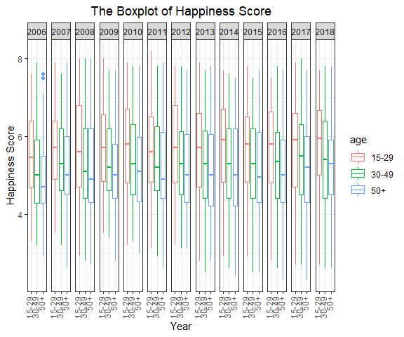
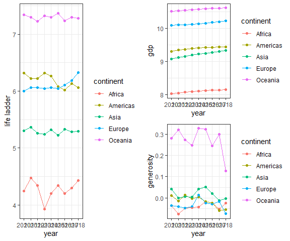
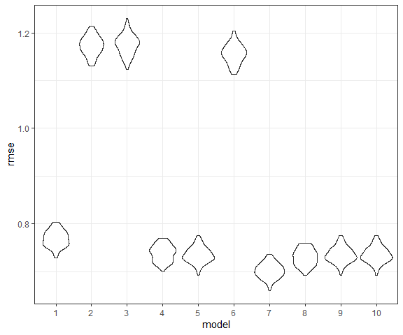
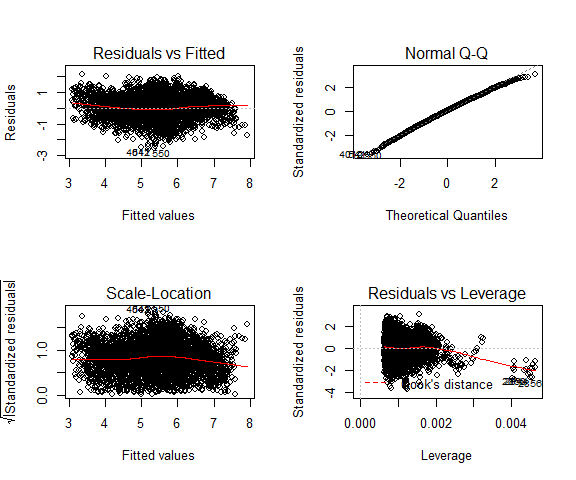

The Secret of Happiness
================
Jingyu Fu (jf3286) Xiaoyang Li (xl2934) Shuya Liu (sl4655) Di Wu
(dw2903) Yuchen Qi (yq2279)
2019/12/4

## Introduction

In living memory, people paid a lot of attention to their health,
especially their physical health. Yet with the development of modern
technology in medicine and a more comprehensive medical care system, the
general physical health of the majority seems to be in good care. With
the guarantee of their basic physical health, people tend to pay more
attention to their mental health. This tendency drives the more frequent
appearance of depressing topics such as “Depression” and “Suicide”. Yet,
in order to make progress and actually change the depressing situation,
people should not only focus on these issues, but also concentrate on
happier thoughts. Hence, in this research, we focus on happiness, how
people feel about their well-being and happiness across countries, and
focus on how the feeling of happy changes over years and the association
or even casual effects between several variables.

The relationship between age and happiness is an interesting issue. In
our daily life, teens seem to be happier than adults with heavier
burden. But we still need more evidence to support this idea.

Also, The debate of whether higher gdp can increase hapiness is never
endless. Some say it does, thus we should work hardly on raising gdp.
Some say it actually has a quite opposite influence on our hapiness.
Which opinion is true according to our data? We choose gdp as one of the
potential key variables to find the association.

Moreover, humans are an extremely prosocial species. Compared to most
primates, humans provide more assistance to family, friends, and
strangers, even when costly. Some evidence indicate that there is
well-being benefits from donating money.

Both related to money, what’s the association between these two variable
and happiness? To answer this question, we use the following three
variables to find the best linear model that describes the association:
age, gdp and generosity. Detailed data description is in the data part
below.

## Related work

Our project is inspired by [Woeld Happiness
Report](https://worldhappiness.report/ed/2019/). This report raises our
interest to study happiness and find its influential factors.

## Research questions

Our research focues on a main question:

  - How does people’s happiness level change in different criterion?

This main question diverges into four minor and more detailed questions.
Those questions are consistent through the course of our
project.Following are our detailed questions:

  - How people’s feeling of happiness differ by where they live?
  - How does people’s feeling of happiness change when people’ grow
    older’s age increase?
  - How does happiness levels of different areas change over the years?
  - Will people’s happiness level change as the change of GDP,
    generosity and age? For those affect happiness level, what is the
    linear association between them and happiness level.

## Data

### Data sources

Our data was downloaded as a .xls file from [World
Poll](https://analyticscampus.gallup.com/?ref=Auth).

### Data cleaning

To analyze our data by continent, we need to add the continent variable
and remove the data without continent variable. The
log\_gdp\_per\_capita was also renamed into gdp for short

``` r
## add continents
df = read_xls("data/Chapter2OnlineData.xls") %>% 
  janitor::clean_names()
```

    ## Warning in FUN(X[[i]], ...): strings not representable in native encoding
    ## will be translated to UTF-8

``` r
df = df %>% 
  mutate(continent = countrycode(sourcevar = country_name,
                                 origin = "country.name",
                                 destination = "continent")) %>% 
  dplyr::select(continent, country_name, everything()) %>%
  drop_na(continent) %>% 
  rename(gdp = log_gdp_per_capita)
```

    ## Warning in countrycode(sourcevar = country_name, origin = "country.name", : Some values were not matched unambiguously: Kosovo

``` r
## read age_group dataset
age_data <- read_excel("./data/GallupAnalytics_Export_20191203_075046.xlsx",
                       range = "B8:G5209") %>%
  janitor::clean_names() %>%
  rename(country_name = geography,
         year = time,
         age = demographic_value,
         n = n_size,
         ladder = value) %>%
  mutate(year = as.numeric(year))
```

### Data description

`life_ladder` represent the happiness score or subjective well-being
which was measured by the Gallup World Poll(GWP) covering years from
2005 to 2018,

`gdp` represent the log transformation of statistics of GDP per capita
in purchasing power parity(PPP) at constant 2011 international dollar
prices are from the November 14,2018 update of the World Development
Indicators (WDI).

`generosity` is the residual of regressing national average of response
to the GWPquestion “Have you donated money to a charity in the past
month?” on GDP per capita.

`age` is devided into 3 age groups: 15-30, 30-49, 50+.

## Exploratory analysis

### Geographica

The geographical distribution of happiness across 165 countries were
visualized. We get the GENC 3-letter codes for countries applying the
countrycode function, and produced interactive plots. Screenshots of
these maps are shown below. To see the fully rendered versions, visit
our
[website](https://qi-yuchen.github.io/P8105_final_project/Geographica.html).
This exploration did not intend to find any associations, at least not
in a rigorous way, but to provide us and our readers a tool to interact
with our data and get an direct understanding of the current situation
of people’s feeling of happiness worldwide. From the distribution
[map](https://qi-yuchen.github.io/P8105_final_project/Geo_world.html),
we can see mean life ladder over years in Europe and Americas is
significantly higher than that in Asia and Africa. Four distribution
[bar
graphs](https://qi-yuchen.github.io/P8105_final_project/Geo_continent.html)
were produced. In each continent, there is obvious diversity with regard
to happiness.


The code for rendering these plots are the following:

``` r
## For this part, the mean life ladder and the country code for each country are needed to produce the global map.
# add the mean happiness
df_geo = df %>% 
  select(continent, country = country_name, year, life_ladder) %>% 
  group_by(continent, country) %>% 
  summarise(mean_life_ladder = mean(life_ladder)) %>% 
  ungroup()

df_geo$continent[165] = "Europe"

# add the country code
df_geo = df_geo %>% 
  mutate(code = countrycode(sourcevar = country,
                                 origin = "country.name",
                                 destination = "genc3c"))
```

``` r
## Global view
# light grey boundaries
l <- list(color = toRGB("grey"), width = 0.5)

# specify map projection/options
g <- list(
  showframe = FALSE,
  showcoastlines = FALSE,
  projection = list(type = 'Mercator')
)

# here is the map
plot_geo(df_geo) %>%
  add_trace(
    z = ~mean_life_ladder, color = ~mean_life_ladder, colors = 'Blues',
    text = ~country, locations = ~code, marker = list(line = l)
  ) %>%
  colorbar(title = 'Expectation of life ladder') %>%
  layout(
    title = 'Global Distribution of Happiness',
    geo = g
  )
```

``` r
## Continent view
# Africa
df_geo %>% 
  filter(continent == "Africa") %>% 
  mutate(country = reorder(country, mean_life_ladder)) %>% 
  plot_ly(x = ~country, y = ~mean_life_ladder, color = ~country, type = "bar") %>% 
  layout(
    xaxis = list(title = "country name", tickangle = -45),
    yaxis = list(title = "expectation of life ladder", range = c(0,8))
    )

# Americas
df_geo %>% 
  filter(continent == "Americas") %>% 
  mutate(country = reorder(country, mean_life_ladder)) %>% 
  plot_ly(x = ~country, y = ~mean_life_ladder, color = ~country, type = "bar") %>% 
  layout(
    xaxis = list(title = "country name", tickangle = -45),
    yaxis = list(title = "expectation of life ladder", range = c(0,8))
    )

# Asia and Oceania
df_geo %>% 
  filter(continent == "Asia" | continent == "Oceania") %>% 
  mutate(country = reorder(country, mean_life_ladder)) %>% 
  plot_ly(x = ~country, y = ~mean_life_ladder, color = ~country, type = "bar") %>% 
  layout(
    xaxis = list(title = "country name", tickangle = -45),
    yaxis = list(title = "expectation of life ladder", range = c(0,8))
    )

# Europe
df_geo %>% 
  filter(continent == "Europe") %>% 
  mutate(country = reorder(country, mean_life_ladder)) %>% 
  plot_ly(x = ~country, y = ~mean_life_ladder, color = ~country, type = "bar") %>% 
  layout(
    xaxis = list(title = "country name", tickangle = -45),
    yaxis = list(title = "expectation of life ladder", range = c(0,8))
    )
```

### Age Group

``` r
## join datasets
age_df <- age_data %>%
  pivot_wider(names_from = age,
              values_from = c(ladder, n)) %>%
  left_join(df, ., by = c("country_name", "year")) %>%
  select(country_name:life_ladder, "ladder_15-29":"n_DK/Refused") %>%
  pivot_longer("ladder_15-29":"n_DK/Refused", 
               names_to = c("variable", "age"),
               names_pattern = "(.*)_(.*)") %>%
  pivot_wider(names_from = variable,
              values_from = value)

## boxplot
age_df %>%
  filter(age != "DK/Refused") %>%
  drop_na %>%
  mutate(age = as.factor(age)) %>%
  ggplot(aes(x = age, y = ladder, color = age)) +
  geom_boxplot() +
  labs(
    title = "The Boxplot of Happiness Score",
    x = "Year",
    y = "Happiness Score"
  ) +
  theme(axis.text.x = element_text(angle = 90, hjust = 0.95, vjust = 0.2)) +
  facet_grid(~year)
```



##### Analysis

By plotting the boxplots throughout the years, we can see that overall
there are distinct differences among these age groups. It is relatively
obvious that the age group of `15-29` have rank their happiness in
higher scores than the other two groups, and the age group of `50+` tend
to have the lowest happiness score . It appears that younger people tend
to have higher happiness score, ie. the `life_ladder` variable.
Therefore, we are going to include `age_group` as one of the factor in
our final regression model since the strong association we see in this
graph.

##### Additional Link

The happiness score for each age groups of different countries
throughout the years can be found on
[this](https://lsyjessica.shinyapps.io/shiny_dashboard_template/) shiny
dashboard.

### Time

As showing in the geographical distribution of happiness, in addition to
the age we mentioned above, we also noticed a variety of happiness among
countries and especially among continents which might be related to the
gdp and generosity scale. In this analysis, we firstly study the
hapiness scale with full data from 2010 to 2018 in the whole world


As for the change of life ladder, gdp and generosity changed through
years for any specific country reader might interested in, the
[link](https://lsyjessica.shinyapps.io/time_shiny/) provided a
visulization plot of the time trend for all countries we studied.

##### Analysis

Considerring the result in time analysis of happiness and gdp,
generosity,it is obvious that the in the 9-year period of intersted
study, the Oceania has the highest level of happiness that above 7
during the study period, while Africa has the lowest level of happiness
ranged from 4 to 4.5 in the study period.Europe and America have similar
life ladder within 6 and 6.5, where America was slightly higher in 2010
than Europe while Europe exceeded since 2015. Asia had life ladder
slightly less than 5.5 and generally kept in a stable level in the study
period. Compared with the gdp scale and the generosity in each
continent, we can easily noticed that a similar pattern exist that
Oceania tended to have the highest average gdp and generosity while
Africa tended to have lowest level, which proved our assumption that in
some degree, these predictors are effective in the outcome of happiness.

## Additional analysis

Based on the analysis above, we found that there might be association
between age, GDP, generosity and happiness. Therefore, we try to make
linear regression model of these factors.

``` r
df_r = df %>% 
  select(country_name, year, life_ladder, gdp, generosity) %>% 
  full_join(age_df) %>% 
  select(ladder, gdp, age, generosity) %>% 
  drop_na(ladder) %>% 
  filter(age != "DK/Refused")
```

    ## Joining, by = c("country_name", "year", "life_ladder")

### Building potential models.

We built 10 potentials models.

Model 1 to 3 use each of the three variables as the only variable.

lm1:\[Y_{happiness} = \beta_0 + \beta_1X_{gdp}\]

lm2:\[Y_{happiness} = \beta_0 + \beta_1X_{generosity}\]

lm3:\[Y_{happiness} = \beta_0 + \beta_1X_{age}\]

Model 4 to 7 use two or three of the three variables as
combination(confounder).

lm4:\[Y_{happiness} = \beta_0 + \beta_1X_{gdp} + \beta_2X_{generosity}\]

lm5:\[Y_{happiness} = \beta_0 + \beta_1X_{gdp}  + \beta_3X_{age}\]

lm6:\[Y_{happiness} = \beta_0 + \beta_1X_{age} + \beta_2X_{generosity}\]

lm7:\[Y_{happiness} = \beta_0 + \beta_1X_{gdp} + \beta_2X_{generosity} + \beta_3X_{age}\]

Model 8 to 10 use interaction of those variables.

lm8:\[Y_{happiness} = \beta_0 + \beta_1X_{gdp} * \beta_2X_{generosity}\]

lm9:\[Y_{happiness} = \beta_0 + \beta_1X_{gdp} * \beta_3X_{age}\]

lm10:\[Y_{happiness} = \beta_0 + \beta_1X_{age} * \beta_2X_{generosity}\]

``` r
lm1 = lm(ladder ~ gdp, data = df_r)
lm2 = lm(ladder ~ generosity, data = df_r)
lm3 = lm(ladder ~ age, data = df_r)

lm4 = lm(ladder ~ gdp + generosity, data = df_r)
lm5 = lm(ladder ~ gdp + age, data = df_r)
lm6 = lm(ladder ~ age + generosity, data = df_r)

lm7 = lm(ladder ~ gdp + generosity + age, data = df_r)

lm8 = lm(ladder ~ gdp * generosity, data = df_r)
lm9 = lm(ladder ~ gdp * age, data = df_r)
lm10 = lm(ladder ~ age * generosity, data = df_r)
```

### Using criterion to find the best model.

We will use several criterion to find our best model.

The first criterion we use is adjusted-r-square, which tells us the
goodness of fit of a model. Higher the value, better the goodness of
fit. Model 7 has the highest value, following are model 8 and 5.

The second set of criteria we use are AIC and BIC, which tell us the
quality of our model. Lower the values, higher the quality. Model 7 has
the lowest AIC and BIC value, following are Model 8 and Model 4.

``` r
model_name = c("lm1", "lm2","lm3","lm4", "lm5","lm6","lm7", "lm8","lm9","lm10")

 rbind(
  broom::glance(lm1),
  broom::glance(lm2),
  broom::glance(lm3),
  broom::glance(lm4),
  broom::glance(lm5),
  broom::glance(lm6),
  broom::glance(lm7),
  broom::glance(lm8),
  broom::glance(lm9),
  broom::glance(lm10)
  ) %>% 
  cbind(model_name) %>% 
  select(model_name, everything()) %>% 
  knitr::kable()
```

| model\_name | r.squared | adj.r.squared |     sigma |  statistic | p.value | df |     logLik |       AIC |       BIC | deviance | df.residual |
| :---------- | --------: | ------------: | --------: | ---------: | ------: | -: | ---------: | --------: | --------: | -------: | ----------: |
| lm1         | 0.5808104 |     0.5807200 | 0.7686979 | 6422.04895 |       0 |  2 | \-5358.821 | 10723.642 | 10742.968 | 2738.805 |        4635 |
| lm2         | 0.0303768 |     0.0301639 | 1.1711829 |  142.67000 |       0 |  2 | \-7183.597 | 14373.193 | 14392.466 | 6246.582 |        4554 |
| lm3         | 0.0298234 |     0.0294093 | 1.1715212 |   72.00895 |       0 |  3 | \-7392.608 | 14793.216 | 14819.027 | 6429.984 |        4685 |
| lm4         | 0.6146129 |     0.6144436 | 0.7384473 | 3630.54763 |       0 |  3 | \-5081.779 | 10171.558 | 10197.255 | 2482.771 |        4553 |
| lm5         | 0.6178395 |     0.6175920 | 0.7341200 | 2496.72599 |       0 |  4 | \-5144.400 | 10298.800 | 10331.010 | 2496.873 |        4633 |
| lm6         | 0.0610575 |     0.0604387 | 1.1527579 |   98.66905 |       0 |  4 | \-7110.352 | 14230.703 | 14262.824 | 6048.929 |        4552 |
| lm7         | 0.6526011 |     0.6522958 | 0.7012624 | 2137.30391 |       0 |  5 | \-4845.380 |  9702.761 |  9741.306 | 2238.040 |        4551 |
| lm8         | 0.6240025 |     0.6237547 | 0.7294761 | 2518.15491 |       0 |  4 | \-5025.590 | 10061.180 | 10093.301 | 2422.280 |        4552 |
| lm9         | 0.6178775 |     0.6174649 | 0.7342420 | 1497.63008 |       0 |  6 | \-5144.170 | 10302.339 | 10347.432 | 2496.624 |        4631 |
| lm10        | 0.0684267 |     0.0674030 | 1.1484777 |   66.84208 |       0 |  6 | \-7092.402 | 14198.805 | 14243.774 | 6001.455 |        4550 |

Obviously, Model 7 wins in all the criterion.

Therefore, we would like to choose the lm7, i.e.
\[Y_{happiness} = -1.39 + 0.77X_{gdp} + 1.36 X_{generosity} + (-0.36)I(age=30-49) + (-0.57)I(age = 50 +)\]

Summary results of lm7 are shown below:

``` r
summary(lm7)
```

    ## 
    ## Call:
    ## lm(formula = ladder ~ gdp + generosity + age, data = df_r)
    ## 
    ## Residuals:
    ##      Min       1Q   Median       3Q      Max 
    ## -2.58930 -0.46244  0.01801  0.49253  2.12918 
    ## 
    ## Coefficients:
    ##              Estimate Std. Error t value Pr(>|t|)    
    ## (Intercept) -1.408639   0.082637  -17.05   <2e-16 ***
    ## gdp          0.776229   0.008818   88.03   <2e-16 ***
    ## generosity   1.356230   0.064189   21.13   <2e-16 ***
    ## age30-49    -0.355120   0.025366  -14.00   <2e-16 ***
    ## age50+      -0.564756   0.025607  -22.05   <2e-16 ***
    ## ---
    ## Signif. codes:  0 '***' 0.001 '**' 0.01 '*' 0.05 '.' 0.1 ' ' 1
    ## 
    ## Residual standard error: 0.7013 on 4551 degrees of freedom
    ##   (132 observations deleted due to missingness)
    ## Multiple R-squared:  0.6526, Adjusted R-squared:  0.6523 
    ## F-statistic:  2137 on 4 and 4551 DF,  p-value: < 2.2e-16

### Checking predictive ability

``` r
cv_df_r = df_r %>% 
  crossv_mc(100) %>% 
  mutate(
    train = map(train, as_tibble),
    test = map(test, as_tibble))

cv_df_r = 
  cv_df_r %>% 
  mutate(lm1 = map(train, ~lm(ladder ~ gdp, data = .x)),
         lm2 = map(train, ~lm(ladder ~ generosity, data = .x)),
         lm3 = map(train, ~lm(ladder ~ age, data = .x)),
         lm4 = map(train, ~lm(ladder ~ gdp + generosity, data = .x)),
         lm5 = map(train, ~lm(ladder ~ gdp + age, data = .x)),
         lm6 = map(train, ~lm(ladder ~ age + generosity, data = .x)),
         lm7 = map(train, ~lm(ladder ~ gdp + generosity + age, data = .x)),
         lm8 = map(train, ~lm(ladder ~ gdp * generosity, data = .x)),
         lm9 = map(train, ~lm(ladder ~ gdp * age, data = .x)),
         lm10 = map(train, ~lm(ladder ~ age * generosity, data = .x))
         ) %>% 
  mutate(rmse_1 = map2_dbl(lm1, test, ~rmse(model = .x, data = .y)),
         rmse_2 = map2_dbl(lm2, test, ~rmse(model = .x, data = .y)),
         rmse_3 = map2_dbl(lm3, test, ~rmse(model = .x, data = .y)),
         rmse_4 = map2_dbl(lm4, test, ~rmse(model = .x, data = .y)),
         rmse_5 = map2_dbl(lm5, test, ~rmse(model = .x, data = .y)),
         rmse_6 = map2_dbl(lm6, test, ~rmse(model = .x, data = .y)),
         rmse_7 = map2_dbl(lm7, test, ~rmse(model = .x, data = .y)),
         rmse_8 = map2_dbl(lm8, test, ~rmse(model = .x, data = .y)),
         rmse_9 = map2_dbl(lm9, test, ~rmse(model = .x, data = .y)),
         rmse_10 = map2_dbl(lm9, test, ~rmse(model = .x, data = .y))
         )    

cv_df_r %>% 
  select(starts_with("rmse")) %>% 
  pivot_longer(
    everything(),
    names_to = "model", 
    values_to = "rmse",
    names_prefix = "rmse_") %>% 
  mutate(model = fct_inorder(model)) %>% 
  ggplot(aes(x = model, y = rmse)) + geom_violin()
```



According to the plot above, RMSE of lm7 is the lowest, which shows that
lm7 works best among all our linear model to fit test data\!

### Checking assuamption

``` r
# check residual assupmtion
par(mfrow = c(2,2))
plot(lm7)
```



We made some assumptions regarding residuals like normality distribution
and constant variance of residuals. According to the diagnostic above,
residuals vs fitted and scale-location indicate the constant variance of
residuals is satisfied. QQ plot demonstrates that residuals follow
normal distribution. And the residuals vs leverage proves there are no
obvious influencial observation in out dataset.

## Discussion

Our best linear regression model is a multiple linear regression model
with GDP, negerosity and age as variables and happiness level as the
outcome. This model indicates that our happiness level will increase as
we increase our gdp and generosity. This is our expected result because
it gives us motivation to develop economics and be more generosity, both
of the which can contribute more positive energy to our society. People
could use this result as a guidance and build a more wealthy,
economic-friendly and warm society.

Meanwhile, we can also tell form the model that younger the age, higher
the happiness. This is also our expected result because, in real life,
it is more likely to see a happy smile on a kid’s face compared to an
adult’s. This indicates that society could pay more attention to mental
health of adults and develop more adults’ mental health care service. On
the other hand, it is also a good way to boost adults’ happiness level
through education about happiness. If people are losing their
sensibility of happiness as they grow up, it means that their ability in
sensing happiness is not developed through their educatoin. Therefore,
schools and colleges could develop their education about happiness. By
doing this, poeple will build a mind set that does well in sensing
happiness and hence the situation of decreasing happiness level as age
increases will be changed in the good way.
