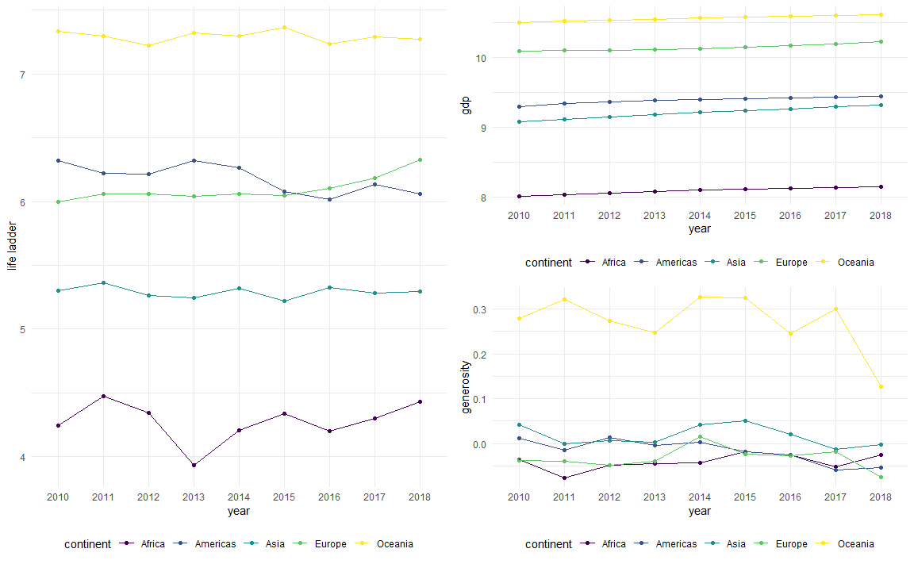

Time
================
Di Wu

In this analysis, we firstly study the hapiness scale with full data
from 2010 to 2018 in the whole world

``` r
plot_cont_happiness+(plot_cont_gdp/plot_cont_gen )
```



It is obvious that the in the 9-year period of intersted study, the
Oceania has the highest level of happiness that above 7 during the study
period, while Africa has the lowest level of happiness ranged from 4 to
4.5 in the study period.Europe and America have similar life ladder
within 6 and 6.5, where America was slightly higher in 2010 than Europe
while Europe exceeded since 2015. Asia had life ladder slightly less
than 5.5 and generally kept in a stable level in the study period.
Compared with the gdp scale and the generosity in each continent, we can
easily noticed that a similar pattern exist that Oceania tended to have
the highest average gdp and generosity while Africa tended to have
lowest level.
